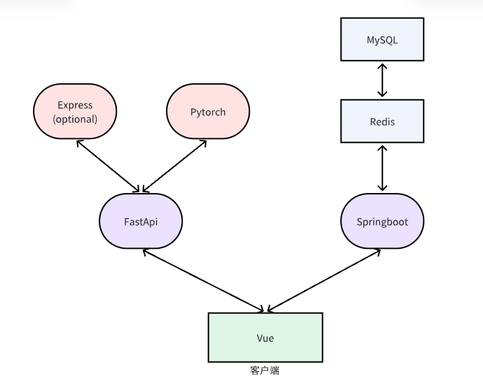

# NABCD模型

[TOC]

## 需求（Need）

在人力资源和招聘领域，处理大量的简历是一项常见但繁琐的任务。许多简历以word文档的形式存在，这使得从这些简历中提取、编辑和管理信息变得非常困难和耗时。因此，市场上存在对一个能够自动从word格式的简历中提取并结构化文字信息的系统的需求。

## 方法（Approach）

我们开发的简历信息提取系统采用了：
- 先进的 AI 技术（BERT）
- Java 语言和 Springboot 框架
- Python FastApi 框架
- MySQL 和 Redis 数据库
- Vue 前端框架

我们采用模块化的管理方法，具体而言，我们分为以下模块：
- 网页 UI 前端，负责页面展示
- Java 语言后端，负责存储提取后的简历信息
- Python 语言后端，负责调用 AI 服务
- Express（可选），用于更好提取 word 文档信息
- 简历信息提取，负责从 word 文档中提取信息并进行处理，生成结构化的简历文本信息
- 人岗匹配，负责根据结构化的简历和岗位信息，为求职者匹配岗位

这些模块的交互关系如下图：

各个模块之间采用 REST API 的方式进行通讯。

利用这些技术，我们能够自动识别图片中的文字信息，并将其转换为可编辑的结构化文本。系统采用模块化的设计，包括用户界面、图像处理、文字识别、信息处理和数据存储等模块，以实现高效、准确的信息提取和管理。

## 益处（Benefit）

通过使用简历信息提取系统，用户可以节省大量人工输入信息的时间和劳动，提高工作效率。系统不仅能够准确识别和提取文字信息，还可以将信息结构化，便于用户编辑和管理。此外，系统还支持信息的导出，方便用户进一步处理和使用。

## 竞争（Competition）

虽然市场上存在一些OCR（光学字符识别）工具和服务，但它们通常仅用于基本的文字识别，并不能满足用户对于信息结构化和管理的需求。我们的系统通过集成大模型技术和模块化设计，提供了一站式的解决方案。

## 交付（Delivery）

简历信息提取系统将通过Gitee开源平台进行分发，用户可以通过我们的Gitee仓库进行下载和安装。我们将提供在线教程和用户手册，帮助用户了解和掌握系统的使用方法。