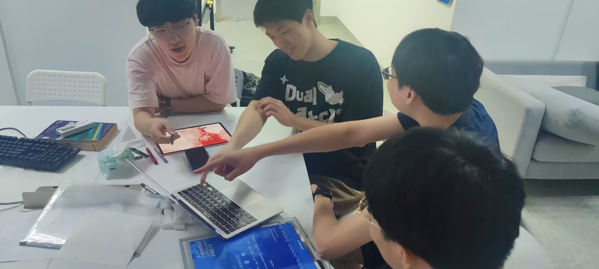

# 简历信息提取系统第一次会议记录

* **参会者**：秦声鸿，胡宇飞，童维希，罗琳程
* **时间**：2023年9月25日周一 软件学院会议室

## 项目选择

简历信息提取系统，利用大模型从图片格式的简历中提取信息，转换成相应的文字。

### 1. 主要技术栈

**分为网页UI前端，Go语言后端，简历图片识别，简历信息提取，以及人岗匹配**

**前端**：HTML，CSS，JavaScript。

**后端**：Go语言。

**简历图片识别**：深度学习，图像处理。

**简历信息提取**：自然语言处理。

**人岗匹配**：推荐算法。

### 2. 团队分工

**前端开发**：罗琳程

**后端开发**：秦声鸿

**简历图片识别**：胡宇飞

**简历信息提取**：胡宇飞

**人岗匹配**：童维希

## 项目分析（头脑风暴）

### 1. 现有简历处理系统效率低下

> * 大量的简历信息以图片形式存在，无法进行有效管理和检索。
> * 人工转录简历信息耗时耗力，无法满足大规模简历处理的需求。

### 2. 改进方式

- [ ] 利用大模型技术，实现从图片格式的简历中自动提取文字信息。
- [ ] 将提取出来的信息进行结构化处理，便于进一步分析和管理。
- [ ] 增加人岗匹配功能，根据结构化的简历和岗位信息，为求职者推荐合适的岗位。

### 3. 题目来源

* 鉴于当前求职市场上简历处理的实际需求，开发这款软件来提高简历处理的效率和准确性。

### 4. 需求

* 用户系统

> * 上传简历图片。
> * 查看和管理提取后的简历信息。

* 简历信息管理系统

> * 存储和管理结构化的简历信息。
> * 提供人岗匹配的功能。

## 思维导图

## 会议图片

